# California-Housing-Prices

Abstract: This repo includes a pipeline using sklearn Regression Models to predict House Prices. We will use California Housing dataset, available in the
sklearn.datasets module. The pipeline involves a systematic approach to data preprocessing, feature engineering, model selection, hyperparameter tuning, and
performance evaluation.

## EDA

To obtain a comprehensive understanding of the predictive attributes and the target variable present in the fetch_california_housing dataset, we can utilize the .DESCR
method.

Firstly, we can see that we have next Attribute Information:

        - MedInc        median income in block group
        - HouseAge      median house age in block group
        - AveRooms      average number of rooms per househol
        - AveBedrms     average number of bedrooms per household
        - Population    block group population
        - AveOccup      average number of household members
        - Latitude      block group latitude
        - Longitude     block group longitude

The target variable is the median house value for California districts,
expressed in hundreds of thousands of dollars ($100,000).

Let’s have an overview of the entire dataset.

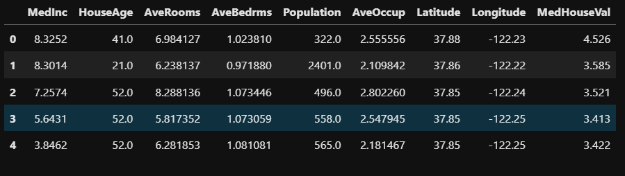

As delineated in the description, the dataset comprises compiled information regarding every region in California. Let us closely scrutinize the characteristics that
can be utilized by a predictive model.

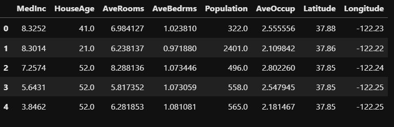

In this dataset, we have information regarding the demography (income, population, house occupancy) in the districts, the location of the districts (latitude,
longitude), and general information regarding the house in the districts (number of rooms, number of bedrooms, age of the house). Since these statistics are at the
granularity of the district, they corresponds to averages or medians.

We can now check more into details the data types and if the dataset contains any missing value.

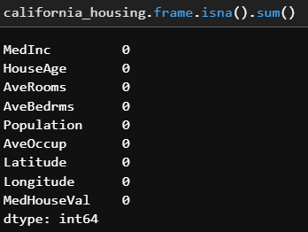
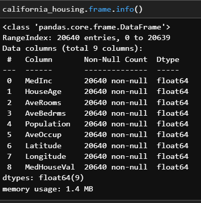

We can see that:

    - the dataset contains 20,640 samples and 8 features;

    - all features are numerical features encoded as floating number;

    - there is no missing values.

Let’s have a quick look at the distribution of these features by plotting their histograms.

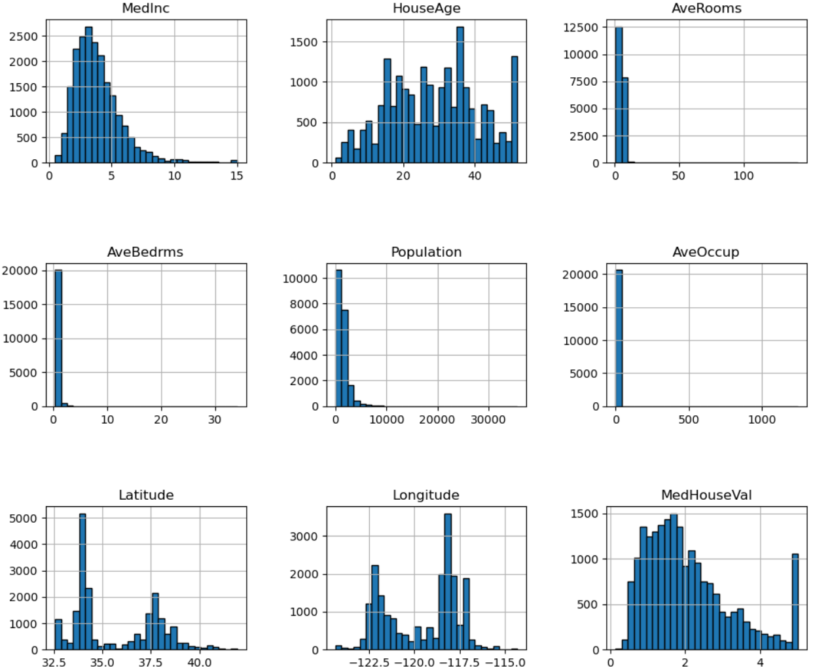

We can begin by directing our attention towards those features whose distributions are likely to conform to our expectations.

The distribution of median income exhibits a long tail, indicating that the earnings of individuals are distributed in a manner that resembles a normal distribution,
albeit with a subset of individuals earning relatively high salaries.

The distribution of the average age of houses appears to be relatively homogeneous.

The target distribution has a long tail as well. In addition, we have a threshold-effect for high-valued houses: all houses with a price above 5 are given the value 5.

When examining the statistics for average rooms, average bedrooms, average occupation, and population, it becomes apparent that the dataset has a wide range of values,
with a negligible bin for the largest values. This indicates the presence of a small number of exceptionally high values, which could potentially be deemed as
outliers. We can see this specificity looking at the statistics for these features:

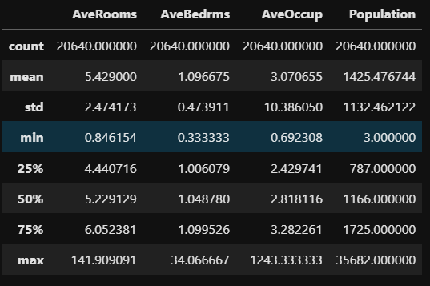

For each of these features, comparing the max and 75% values, we can see a huge difference. It confirms the intuitions that there are a couple of extreme values.

Now we will analyse correleation between features and target variable

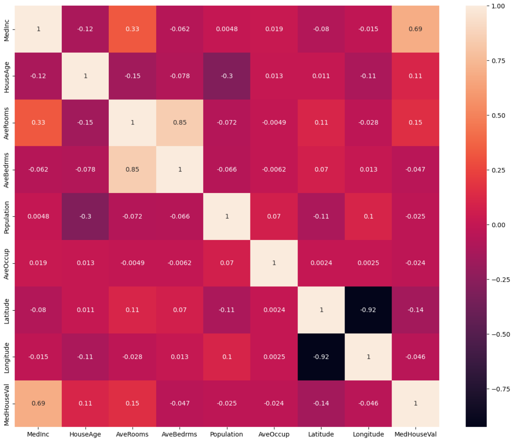

We can see that:

   - House values are significantly correlated with median income
   - Longitude and Latitude should be analyzed separately (just a correlation with target variable is not very useful)

Longitude and Latitude:

The combination of this feature could help us to decide if there are locations associated with high-valued houses. Indeed, we could make a scatter plot where the x-
and y-axis would be the latitude and longitude and the circle size and color would be linked with the house value in the district.

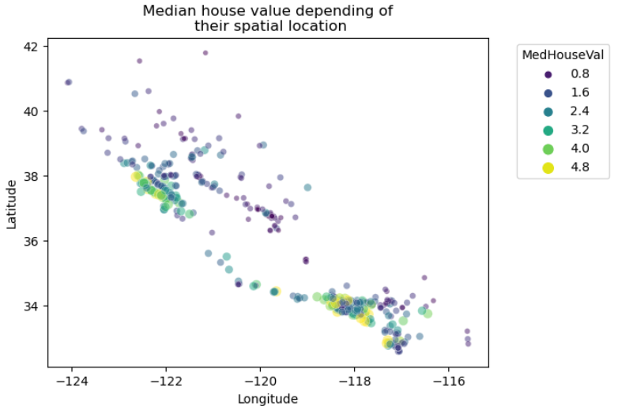

Thus, creating a predictive model, we could expect the longitude, latitude, and the median income to be useful features to help at predicting the median house values.

## Methodology

We will try several regressors available in sklearn such as: 

    - Linear
    - Ridge
    - LASSO
    - Decision trees
    - Random forests
    - Gradient boosting

The preprocessing stage involved scaling and normalization of the data for Linear, Ridge, and LASSO models. This was necessary as these models are sensitive to the
scale of the features, and failure to preprocess the data may lead to suboptimal results. On the other hand, the tree-based algorithms used in Random Forests, Decision
Trees, and Gradient Boosting Regressor are not affected by the scale of the features, and therefore, no preprocessing was required.

The performance metrics used to evaluate the models were R2 Score, Mean Squared Error (MSE), and Root Mean Squared Error (RMSE). These metrics were chosen as they
provide an accurate measure of the model's ability to predict the target variable. To ensure that the models' performance was not due to chance, each model underwent
fine-tuning through hyperparameter Grid Search. This involved testing different combinations of hyperparameters to identify the optimal combination that yields the
best possible results.

The hyperparameter Grid Search process was thoroughly examined in the experiments.ipynb file to gain a deeper understanding of the factors that influence model
performance. This was done to enable the development of more accurate and effective predictive models. By understanding the impact of each hyperparameter on the
model's performance, we can develop more informed and effective strategies for fine-tuning models in the future.

## Results

Models before and after Grid Search:

| Model | R2 Before |  MSE Before |  RMSE Before | R2 After |  MSE After | RMSE After |
| ------ | ------ | ------ | ------ | ------ | ------ | ------ |
| Desision Tree | 0.599 | 0.531 | 0.729 | 0.618 | 0.506 | 0.711 |
| Random Forests | 0.812 | 0.248 | 0.498 | 0.817 | 0.241 | 0.491 |
| Linear Regression | 0.553 | 0.591 | 0.769 | 0.607 | 0.520 | 0.721 |
| LASSO | 0.480 | 0.689 | 0.830 | 0.510 | 0.649 | 0.806 |
| Ridge | 0.553 | 0.591 | 0.769 | 0.607 | 0.520 | 0.721 |
| Gradient Boosting | 0.790 | 0.277 | 0.526 | 0.843 | 0.207 | 0.455 |
 
With applied standartization:

| Model | R2 |  MSE |  RMSE |
| ------ | ------ | ------ | ------ |
| Linear Regression | 0.607 | 0.520 | 0.721 |
| LASSO | 0.439 | 0.558 | 0.747 |
| Ridge | 0.604 | 0.524 | 0.724 |

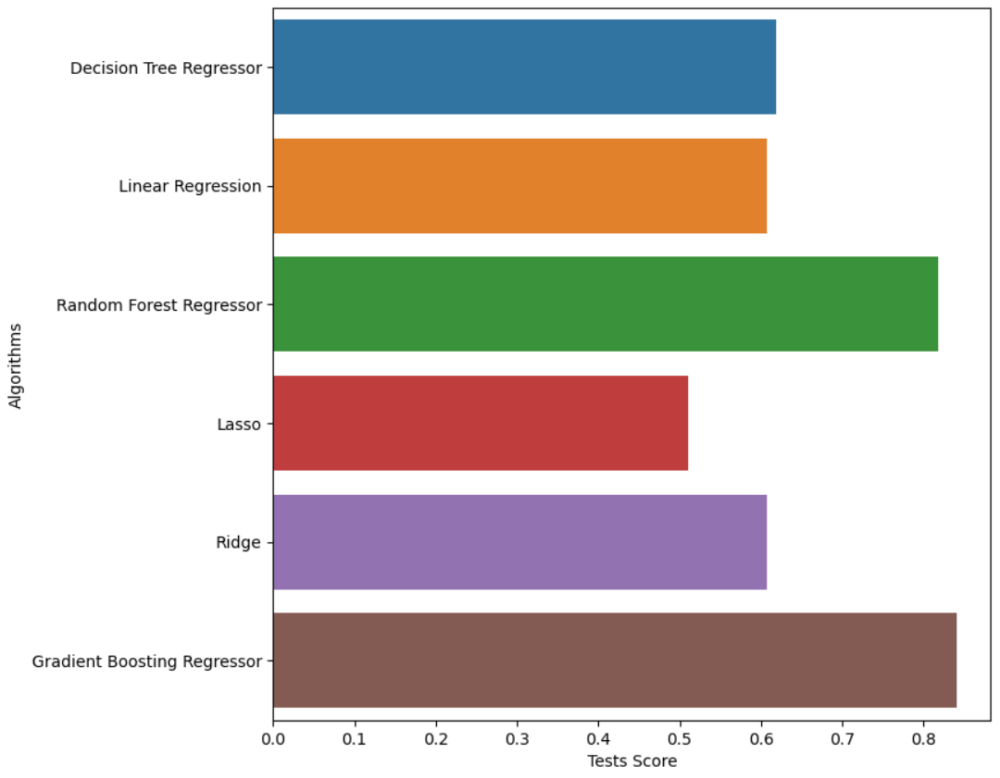

Gradient boosting regressor best one after fine-tuning. Values do not lie us. We will choose then this model to show predictions and results.

We can visualize the feature importances to get more insight into our model. Gradient Boosting:

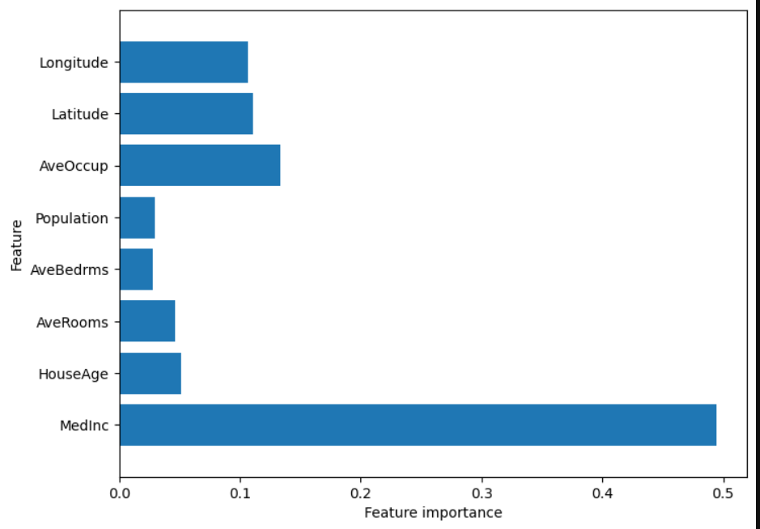

To compare our top-2 model Random Forests:

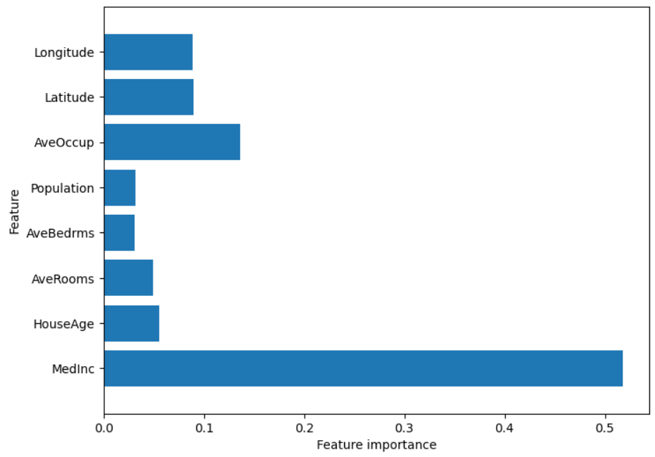

We can see that the feature importances of the gradient boosted trees are similar to the feature importances of the random forests, it gives weight to all of the
features in this case.

Gradient boosting cross validation scores (KFold(n_splits=10...)) with neg_mean_squared_error metrics from sklearn:
- 0.21325311, 0.22295834, 0.21388219, 0.2171086 , 0.22110809, 0.22049503, 0.21087374, 0.19515259, 0.2248454 , 0.18383489

Average:
- 0.46081579456222455

Let's also visualize predictions:
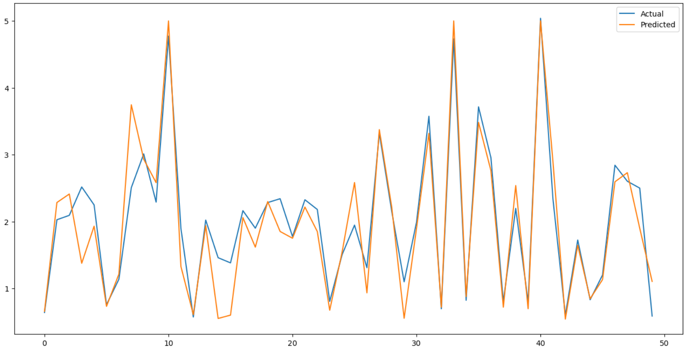
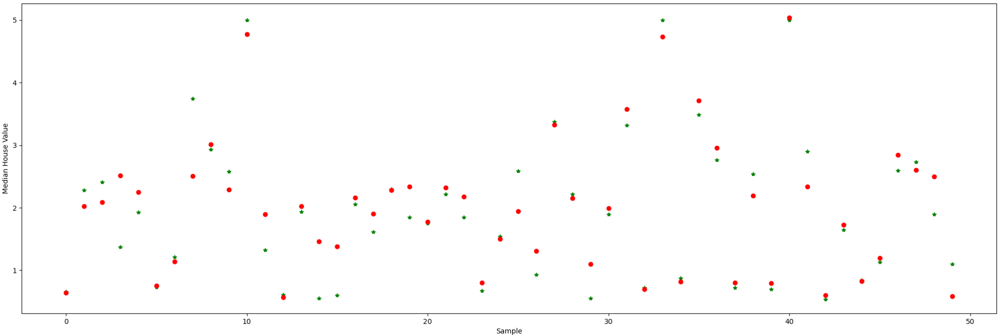

## Files Description

- EDA.ipynb encompasses an exploratory data analysis, statistical inference, and related tasks. The visual representations and figures utilized in the exploratory data
analysis phase were extracted from this file.
- experiments.ipynb file houses a series of experiments evaluating the efficacy of normalization and scaling techniques, fine-tuning procedures, and a particularly
fruitful approach
- best_eval.ipynb includes the implementation of cross-validation and the visualization of the resulting metrics.

## Conclusion

In conclusion, we used a systematic approach to predict house prices using the California Housing dataset. We started by performing exploratory data analysis to
understand the dataset's features and target variable, identifying potential outliers, and examining the correlation between features and target variable. We then
applied various regression models and evaluated their performance using R2 Score, Mean Squared Error, and Root Mean Squared Error. Our analysis shows that Gradient
Boosting Regressor performed the best among all the models, yielding an R2 score of 0.82 and an RMSE of 0.45. We also fine-tuned the models using hyperparameter Grid
Search to improve their performance. This study provides insights into the application of regression models for predicting house prices, demonstrating the importance
of feature engineering, model selection, and hyperparameter tuning.
